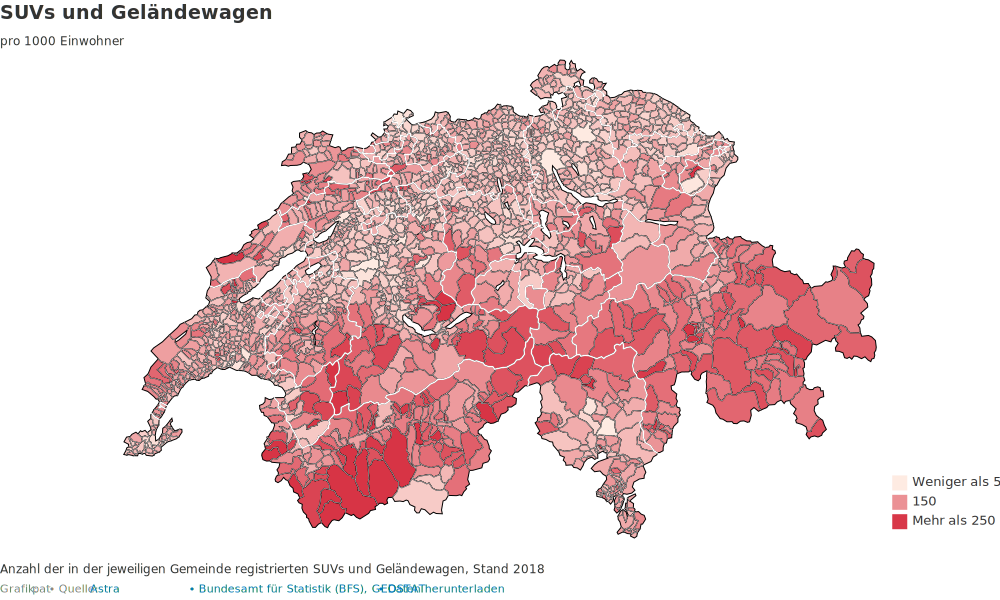
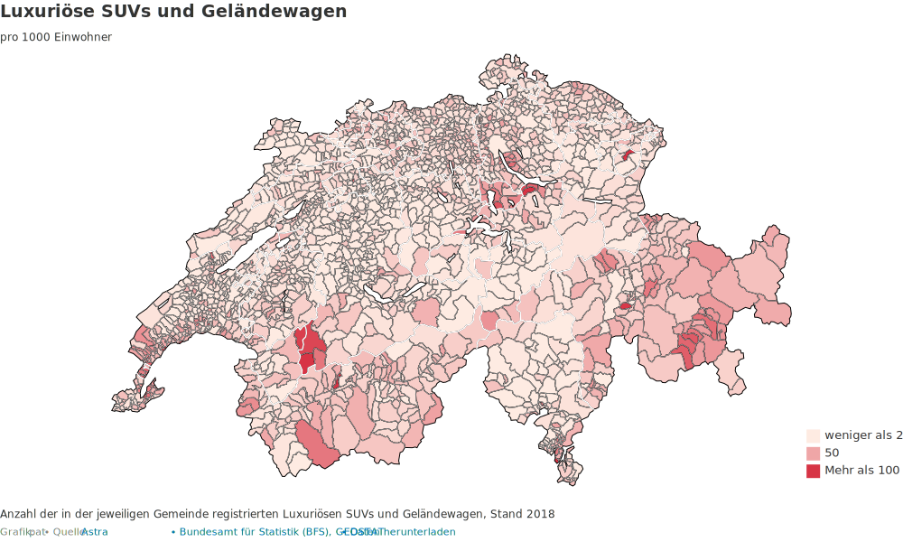

# SUV Analyse Schweiz

**Datenquelle(n)**: Bundesamt für Strassen (ASTRA) ([astra.admin.ch](https://www.astra.admin.ch/astra/de/home.html))

**Artikel**: [Wird publiziert am 1. Dezember 2019](https://www.tagesanzeiger.ch/)

**Code**: [Juypter Notebook](SUV_Analyse_Schweiz.ipynb)

## Beschreibung

Erstmals soll die Verteilung der SUVs und Geländewagen in der Schweiz auf Gemeindeebene dargestellt und untersucht werden. In der Schweiz gibt es keine offizielle Definition was als "SUV" oder als "Geländewagen" gilt. Deshalb greifen wir auf eine Liste der deutschen Behörden zurück, welche eine solche Kategorisierung vornimmt. Der im weiteren Text verwendete Begriff "SUV" bezieht sich sowohl auf SUVs als auch auf Geländewagen gemäss dieser Liste.

Als Grundlage dient ein Datenbank des ASTRA mit allen registrierten Fahrzeugen in der Schweiz. Mit Hilfe der oben genannten Liste können die in der ASTRA Datenbank erfassten Fahrzeuge als SUV oder nicht-SUV klassifiziert werden. Zusätzlich wird noch eine Klassifizierung luxuriöser SUVs vorgenommen.

## Datengrundlage

### Fahrzeuge

File: [Mockup_Data.csv](Data_input/Mockup_Data.csv)

Das Astra unterhält eine Datenbank mit allen registrierten Fahrzeugen in der Schweiz. Ein Auszug aus dieser Datenbank dient als Grundlage für diese Analyse. Der Auszug erfolgte im Februar 2019.

Der Datensatz enthält eine Zeile für jedes registrierte Fahrzeug. Insgesamt enthält der Datensatz 64 Variablen für jedes Fahrzeug. Die in der Analyse verwendeten Variablen sind hier erklärt:

| Variable          | Beschreibung                                                 |
| ----------------- | ------------------------------------------------------------ |
| `Fahrzeugart`     | Art des Fahrzeuges. In dieser Analyse werden nur "Personenwagen" berücksichtigt |
| `Marke`           | Marke des registrierten Fahrzeuges                           |
| `Marke_und_Typ`   | Marke und Typ des registrierten Fahrzeuges                   |
| `BFS-Gemeinde-Nr` | BFS-Gemeindenummer der Gemeinde in welcher das Fahrzeug registriert wurde |
| `Staat_Code`      | Code des Landes in welcher das Fahrzeug registriert wurde    |

Der verwendete Datensatz ist nicht öffentlich zugänglich und kann deshalb nicht in diesem Github Repo zur Verfügung gestellt werden. Stattdessen wir ein kleiner Auszug aus dem Datensatz zur Verfügung gestellte (10'000 Zeilen). Der Datensatz ist zusätzlich auf die folgende Art unkenntlich gemacht:

- Spalte `Erstinvekehrsetzung_Kanton` wurde mit einem Platzhalter versehen
- Spalte `Spalte Inverkehrsetzung_Kanton` wurde mit einem Platzhalter versehen
- Spalte `PLZ` wurde mit einem Platzhalter versehen
- Spalte `Ort` wurde mit einem Platzhalter versehen
- Spalte `BFS-Gemeinde-Nr` ist mit einer zufälligen (validen) BFS Nummer versehen.

### SUV Typen

File: [Typenliste SUV - export.csv](Data_output/karte_gemeinden_28112019.csv)

In der Schweiz werden SUVs nicht gesondert erfasst. Es gibt also keinen Eintrag in der Datenbank welcher den Rückschluss erlauben würde, ob es sich bei einem Fahrzeug um ein SUV handelt. Um Personenwagen als SUVs zu klassifizieren haben wir auf eine Liste der deutschen Behörden zurückgegriffen, welche eine solche Einteilung vornimmt. Auf dieser Liste sind die 117 (in Deutschland) häufigsten SUVs und Geländewagen aufgeführt. Zusätzlich habe wir die Liste mit Luxus-Geländewagen von Maserati, Lamborghini, Cadillac und Rolls Royce ergänzt.

Zusätzlich haben wir auf dieser Liste Fahrzeuge als "luxuriös" kategorisiert, die gemeinhin mit Luxus assoziiert werden.

Folgende Variablen sind in der Typenliste:

| Variable        | Beschreibung                                                 |
| --------------- | ------------------------------------------------------------ |
| `Marke`         | Marke des Fahrzeuges.                                        |
| `Typ`           | Möglichst kurze aber eindeutige Bezeichnung des Typs für die maschinelle Suche nach dem Typen innerhalb der Marke. |
| `entfernen`     | Soll dieser Typ berücksichtigt werden in der Analyse? (Es werden nur Typen entfernt, die bereits mit einem anderen Eintrag erfasst werden). |
| `such_typ`      | - "alle": Alle Fahrzeuge dieser Marke werden als SUV klassifiziert. (Wird nur bei Hummer gemacht) - "normal": Normaler Suchmodus - "exakt": Es werden nur Fahrzeuge welche die exakte Entsprechung des Typs in der Typenbezeichnung haben (wird nur für die Mercedes "R" und "G" Modelle verwendet, da diese sonst zu viele Treffer liefern) |
| `original_typ ` | Ursprüngliche Bezeichnung des Typs, wird nicht für Maschinelle Suche verwendet. |
| `Lux `          | Kategorisierung, ob es sich um ein luxuriöses SUV handelt oder nicht. |

### Bevölkerungsdaten

File: [Bevoelkerung_2018_export.csv](Data_input/Bevoelkerung_2018_export.csv)

Einwohner für jede Gemeinde, Stand 2018 vom BfS.

## Analyse

Alle Fahrzeugtypen der SUV-Liste werden im ASTRA Datensatz gesucht. Dabei werden zuerst alle Einträge einer bestimmten Marke gesucht. Danach werden innerhalb dieser Marke die verschiedenen Typen mit Hilfe der Bezeichnung `Typ` gesucht. 

Es ist nicht ausgeschlossen, dass es zu falsch klassifizierten Fahrzeugen kommen kann. Gründe dafür können sein:

- Falsch geschrieben Marken oder Typenbezeichnungen
- Alte Typenbezeichnungen die inzwischen geändert haben

Zudem ist die SUV-Typenliste nicht abschliessend. Es sind nur nur die häufigsten 117 Modelle enthalten.

## Resultate

Insgesamt wurden 830'000 der ca. 4.6 Millionen registrierten Personenwagen als SUV klassifiziert.

Alle Resultate sind im Ordner [Data_output](Data_output/karte_gemeinden_28112019.csv) gespeichert.

Die Resultate der Analyse (Anzahl SUVs pro Gemeinde) sind im folgenden file gespeichert: [karte_gemeinden_28112019.csv](Data_output/karte_gemeinden_28112019.csv)

Folgende Parameter werden ausgegeben:

| Variable          | Beschreibung                                                 |
| ----------------- | ------------------------------------------------------------ |
| `Ort`             | Gemeinde                                                     |
| `Bevölkerung`     | Anzahl Einwohner der Gemeinde                                |
| `Anzahl_auto`     | Anzahl registrierter Personenwagen in der Gemeinde           |
| `Anzahl_SUV `     | Anzahl der SUVs in der Gemeinde                              |
| `Anzahl_luxSUV`   | Anzahl luxuriöse SUVs in der Gemeinde                        |
| `SUV_per_pop `    | Anzahl SUVs pro Einwohner                                    |
| `SUV_per_auto`    | Anteil der SUVs von allen registrierten Personenwagen        |
| `luxSUV_per_pop`  | Anzahl luxuriöse SUVs pro Einwohner                          |
| `luxSUV_per_auto` | Anteil der luxuriösen SUVs von allen registrierten Personenwagen |

Weitere aggregierte Resultate sind in den File in den Files  [Top_Marken_28112019.csv](https://github.com/tamedia-ddj/SUVs/blob/master/Data_output/Top_Marken_28112019.csv) und [Top_Typen_28112019.csv](https://github.com/tamedia-ddj/SUVs/blob/master/Data_output/Top_Typen_28112019.csv) gespeichert.

Bei den Files mit dem Begriff "Mockup" im Namen handelt es sich um Resultate mit dem anonymisierten Datensatz aus dem Rechnungsbeispiel im Jupyter Notebook.

## Lizenz

*SUV Analyse Schweiz* is free and open source software released under the permissive MIT License.
